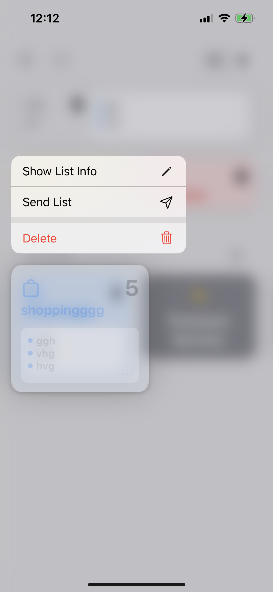

# Developer Knowledge Base

## Common Gotchas

### Hot-reload not working (or always showing a previous change)

Hot reload doesn't work properly in the root `App.js` component. Converting the `App.js` to a _class_ component may help (see https://github.com/expo/expo/issues/4957).
Try adding a change in a _child_ component to see if hot reloading is working for you.

## Selection of libraries

### Context menu

Background: When user does a long press on a list item, we need to display a [context menu](https://developer.apple.com/design/human-interface-guidelines/components/menus-and-actions/context-menus) with items that allow to perform a common operations with this list:

1. Edit the list information (title, color, icon).
2. Delete the list (destructive, irreversible action).
3. Share a list (ideally, in a form of an [App Clip](https://developer.apple.com/app-clips/)).

Also, the visual requirements would be:

* The context menu should look native (system colors, icons, seperators, etc.).
* The selected list item should become semi-transparent.
* The background behind the selected list item should become blurred.

A desirable output:

(Credit and inspiration - [ToDo List app](https://apps.apple.com/pl/app/to-do-list-tasks-reminders/id1476066606?l=pl))

Choosing a library that would satisfy all these requirements turned out to be a non-trivial task.

### Options

* [react-native-hold-menu](https://github.com/enesozturk/react-native-hold-menu)
* [react-native-context-menu-view](https://github.com/mpiannucci/react-native-context-menu-view)
* [@react-native-menu/menu](https://github.com/react-native-menu/menu)

#### react-native-hold-menu

**Pros**:

* Pure React Native solution (doesn't use native UIMenu, implements its own React component). The benefit is that you can install and use this library easier, without having to create a development build for Expo, for example.
* No issues with navigation, - separates press and long-press very well, so they aren't triggered both on a long press.
* Handles menu positioning well (drop to top, drop to bottom).
* Declarative definitions for the menu item handlers (`onPress` is provided for a menu item directly)

**Cons:**

* Pure React Native solution. The drawback is that using the menu component provided by the OS guarantees it functions properly in the future OS releases.
* A consequence of the previous item, - it doesn't match the native context menu visually and, overall, immediately gives a sense of "non-nativeness":
  * Uses different font and font colors for menu items (e.g., the red is too red, and it's immediately aparent for an iOS user).
  * Doesn't use system icons, which also is very aparent.
  * The menu separator is slightly different (wider).

* The blur behind a selected item also feels different (this is strange, because it uses `expo-blur`, which claims to use the native `UIView`-blur component)
* It's not possible to customize the "preview item" (the item we've long-pressed to trigger the context menu).
* The API is slightly awkward, mainly for using icons.
* It's very early in beta (`v0.1.5`), and the author himslef doesn't reccomend to use this lib in producton 🤷.

#### react-native-context-menu-view

**Pros:**

* Native solution (icons, fonts, colors, separators - everything mathches).
* Customisable "preview item".
* Support for a dropdown version.
* Blur behind the preview item feels good.
* In `v1.9.0`, which seems good.

**Cons:**

* Issue with navigation. The long-press action almost always triggers the short press, which is bound to opening a list details screen.
* Very strange API, to say the least:
  * `onPress` on the `<ContextMenu />` element isn't related to this element at all. Instead, it should _imperatively define_ all onpress actions for _all_ menu items at once.
  * To define a separator between menu items, you have to do some weird trick like defining a sub-group of `actions` inside a top-level `action` and combine this with `inlineChildren: true` parameter. Not only this is wasteful and error-prone, it also contradicts its own _type declarations_ and makes TypeScript mad at you!

#### @react-native-menu/menu

Tried this one briefly. On a first glance, it's somewhat similar to `react-native-context-menu-view` (native, with system fonts, colors and icons).
It uses this weird imperative handler for all menu actions at once as well.
Also, it should have the same issue with navigation from what I see from the source code.

Also, a few things seem missing:

1. (!) An ability to customise an anchor position [open issue](https://github.com/react-native-menu/menu/issues/173).
2. (!) Separators (dividers) for menu items [open issue](https://github.com/react-native-menu/menu/issues/271).
3. An ability to customise a preview item.

Has a few extras:

1. An ability to customise a font color of a menu item.
2. Sub-menus (discouraged practice overall but stil an option)

After reading the issues page, decided to not waste time trying to create an implementation with this library.

### Decision

An accidental discovery has been made when I installed _both_ `react-native-context-menu-view` and `react-native-hold-menu` libraries at the same time and tested their components under a switch.
Wrapping the `<App />` component in the `<HoldMenuProvider>` auto-magically fixed the issue with navigation for `<ContextMenu>`.
This 99.9% happens because `<HoldMenuProvider>` uses `react-native-gesture-handler.GestureHandlerRootView` internally and properly declares all gesture handlers (press, long press, etc.), preventing a multiple handlers to trigger simultaneously.
This means that I should be able to implement my own small solution for the issue without pulling in the entire library and use it only as a hacky fix for another library.

For now, though, I decided to use his setup (`react-native-context-menu-view` for actual context menu component, `react-native-hold-menu` for fixing the gesture handling and the issue with triggering on-press navigation after a long press).
